# Development Log - Goal Breaker

## Session: September 3, 2025

### 🎯 Primary Fix: Canvas Goal Positioning Layout
**Issue:** New sub-goals were overlapping and appearing in random positions
**Solution:** Implemented organizational chart-style positioning:
- Ultimate goal positioned on right side of canvas
- Sub-goals appear leftwards in columns (right→left hierarchy)  
- Children distributed evenly around parent's vertical center
- Added `calculateChildPosition()` function for balanced spacing

### ⚙️ Technical Changes Made:

**1. Modified `gridToPosition()` in `gridHelpers.ts`:**
- Changed to right-to-left layout: `x = canvasWidth - MARGIN - ((level + 1) * COLUMN_WIDTH)`
- Ultimate goal (level 0) now positions on right side

**2. Added `calculateChildPosition()` function:**
- Distributes children around parent's center point
- First child aligns with parent height
- Multiple children spread evenly above/below parent
- Prevents overlapping with intelligent spacing

**3. Updated `addSubGoal()` function:**
- Now uses `calculateChildPosition()` instead of basic grid positioning
- Gets existing siblings to calculate balanced distribution

**4. Fixed `addRootGoal()` positioning:**
- Ultimate goal appears on right side instead of center
- Maintains right-to-left organizational flow

**5. Bug Fix - Syntax Error:**
- Removed duplicate `const` keywords
- Fixed double semicolons causing compile failures

### 🧪 Expected Behavior:
- Ultimate goal: Right side, vertically centered
- Level 1 goals: Left of ultimate goal, distributed vertically
- Level 2+ goals: Left of parent, evenly spaced around parent center
- Clean hierarchical flow: Right → Left columns

### ✅ Status: Ready for Testing
Need to verify positioning works correctly before moving to next bug fixes.

---

## Session: September 4, 2025

### 🎯 Bug Fix: Task Editing Space Utilization
**Issue:** Task editing textarea only used ~50-60% of available card space, tooltip overflowed into adjacent cards
**Solution:** Optimized editing area space utilization and repositioned tooltip

### ⚙️ Technical Changes Made:

**1. Enhanced Textarea Space Utilization:**
- Changed textarea height from `h-16` (64px) to `h-full` 
- Changed wrapper div to `w-full h-full` to utilize full content area
- Textarea now expands to fill available card space (card is 320x120px)

**2. Fixed Tooltip Overflow:**
- Moved tooltip from `absolute -bottom-6 left-0` to `absolute top-0 right-0`
- Added proper styling: `shadow-lg border border-gray-200 z-10`
- Tooltip now appears in top-right corner of editing area, no overflow

### 🧪 Expected Results:
- Much larger editing area utilizing ~80-90% of card space
- Tooltip stays within card boundaries
- Better user experience for task editing

### ✅ Status: Ready for Testing
Single change approach - test this before next modification.

### 🎯 Next Priority:
Test the improved editing experience, then address other canvas bugs from backlog.

---

## Session: September 6, 2025 

### 🎯 Feature Implementation: Mermaid Import Functionality
**Goal:** Enable users to import goal structures from Mermaid diagram code
**Status:** ✅ COMPLETED - Ready for Testing

### ⚙️ Technical Implementation:

**1. Added `importFromMermaid()` parser in `mermaidHelpers.ts`:**
- Validates Mermaid format (must start with "graph TD")
- Parses node definitions: `A["📝 Task Name"]` and `A["✅ Completed Task"]` 
- Parses connections: `A --> B`
- Validates maximum 4 levels depth limit
- Converts to Goal data structure with proper positioning
- Comprehensive error handling and validation

**2. Enhanced Main Component (`GoalBreakdown/index.tsx`):**
- Added import modal state management (`isImportModalOpen`, `importText`, `importMessage`)
- Added confirmation dialog when replacing existing goals
- Implemented three handler functions:
  - `handleImportClick()` - Opens modal with confirmation if goals exist
  - `handleImportCancel()` - Closes modal and cleans state
  - `handleImportConfirm()` - Validates and imports Mermaid code

**3. Updated UI Components:**
- Replaced placeholder "Coming Soon" Import button with functional version
- Added comprehensive import modal with:
  - Large text area for Mermaid code input
  - Format validation and error messaging
  - Built-in format guide and examples
  - Proper modal styling and responsive design

**4. Import Validation Features:**
- Real-time error messaging for invalid formats
- Support for completed (✅) and incomplete (📝) task emojis
- Prevents import of overly complex structures (4+ levels)
- Handles empty/invalid input gracefully

### 🧪 Expected User Flow:
1. Click Import button in hamburger menu
2. If existing goals: Confirmation dialog appears
3. Modal opens with text area and format guide
4. User pastes/types Mermaid code
5. Real-time validation shows errors if any
6. Click "Import Goals" replaces current structure
7. Canvas resets to show imported structure

### 🔧 Import Format Supported:

```mermaid
graph TD
    A["📝 Main Goal"]
    B["📝 Sub Task 1"] 
    C["✅ Completed Task"]
    A --> B
    A --> C
```

### ✅ Implementation Complete:
- Parser function handles complex nested structures
- UI provides clear feedback and guidance
- Maintains existing app philosophy of simplicity
- Compatible with current export format

### 🎯 Next Steps:
- User testing with real Mermaid code samples
- Potential refinements based on user feedback
- Consider file upload capability in future iterations

### 📋 Backlog Status Update:
- ✅ **MUST HAVE: Import simple Mermaid formatting** - COMPLETED
- Next priority: "Ask to confirm each delete, especially main goal"